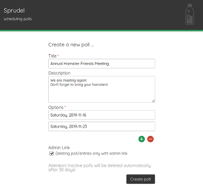

# Sprudel - a quick overview
A flexible, self-hosted webapp for scheduling and polls, based on **PHP** and **MySql**

## Create a poll
- built-in datepicker
- free entry of options (can be dates or anything else)
- optional admin links to ensure only the author of a poll can delete it
  

## Share it, participate
- clean interface
- poll options weight visualization
- comments feature
- *Mini View* feature (for very big poll tables)

# Description
Sprudel is a self-hosted webapp based on PHP and MySql. It offers simple polls for scheduling events, but it's not limited to polling dates. You may also create polls to plan who's bringing what for the buffet or how you should name your firstborn or whatever.  
Sprudel is meant to be easy to use and offers all the relevant features you need for a (scheduling) poll - no more no less.  

# Features
- easy, clean polls for events (dates) or anything you want, really
- `yes`/`no`/`maybe` options
- unique URL for sharing and accessing a poll
- (optional) admin URL for managing a poll
- entries can be removed or overridden
- commenting feature
- **customizable labels:** all the labels and texts can be set to custom strings, so you can change the language and all
- **customizable colors:** all the colors can easily be set to your liking (system-wide, that is, not for individual polls)
- cleanup-script included for deleting polls that have been inactive for more than X days (can be run via cronjob)
- one-click copying of the poll URL
- optional poll administration interface for managing all the polls on the server

# Requirements
- PHP 5.4 or higher  
- A MySql database  

# Installation
This is fairly easy *if* you know how to create a new MySql-database and how to upload files to your webserver. If you don't, try to find out how these things are done beforehand - it's easy to find tutorials about this on the internet!
- Create an empty MySql database on your server
- Download Sprudel as .zip-archive from this repository
- Extract the contents of the archive into a new directory (e.g. `sprudel`)
- Copy the `config.php_template` and rename the copy to `config.php`
- Edit the `config.php` and insert the database's credentials (read comments!)
- **If you want to use the optional admin interface** (to view and delete any polls without owning the poll) you have to set this in the `config.php`, too! If you do so, please secure the `admin`-directory, so it cannot be accessed without a password! If you run Sprudel on an Apache webserver, you may use the `_template`-files in this directory and change them to your needs. Please read about how to secure a directory on your web server before using the admin interface!
- Upload the `sprudel`-directory to your server (root-directory or somewhere else)
- Access `<your install folder>/install` through your browser (e.g. `domain.com/sprudel/install`)
- If everything is fine, Sprudel will tell you so.
- Delete the `install` folder from your server
- If you are using the admin interface and run an **Apache** web server, create `.htaccess` and `.htpasswd` file in `admin/` to secure the access.
- If you use **Nginx**, [you can do the same](https://docs.nginx.com/nginx/admin-guide/security-controls/configuring-http-basic-authentication/).
- Enjoy

# Packaged Software/Media
Sprudel makes use of the following software/media and says *Thank you!* to:
- [Medoo](https://github.com/catfan/Medoo)
- [Datepicker](https://github.com/fengyuanchen/datepicker)
- [jQuery](https://github.com/jquery/jquery)
- [clipboard.js](https://github.com/zenorocha/clipboard.js)
- [Icons from iconmonstr.de](http://www.iconmonstr.de)

